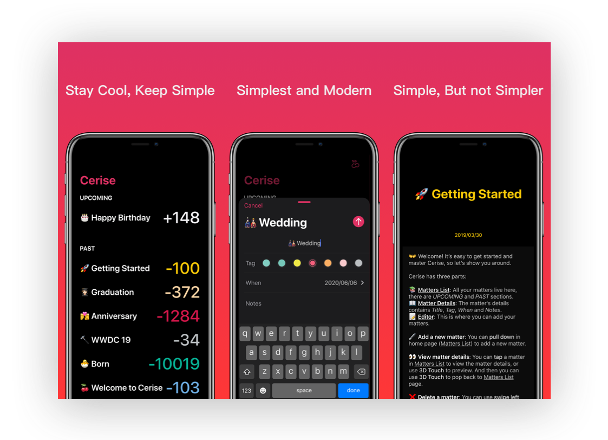

# Cerise

A simple countdown app helps you countdown to those wonderful moments that matters to you. [SwiftUI version](https://github.com/xspyhack/Cherry).

## Architecture Concepts

* [RxSwift](https://github.com/reactivex/rxswift) + MVVM
* Immutable models

[Coordinator](https://github.com/xspyhack/Cerise/tree/coordinator) branch for **Coordinator** Architecture.

## Credits

* [RxSwift](https://github.com/reactivex/rxswift)
* [RxDataSources](https://github.com/RxSwiftCommunity/RxDataSources)
* [Keldeo](https://github.com/xspyhack/Keldeo)
* [Ditto](https://github.com/xspyhack/Ditto)
* [Carthage](https://github.com/Carthage/Carthage)
* [SwiftLint](https://github.com/realm/SwiftLint)

## License

Cerise is available under the MIT License. See the [LICENSE](./LICENSE) file for more info.
